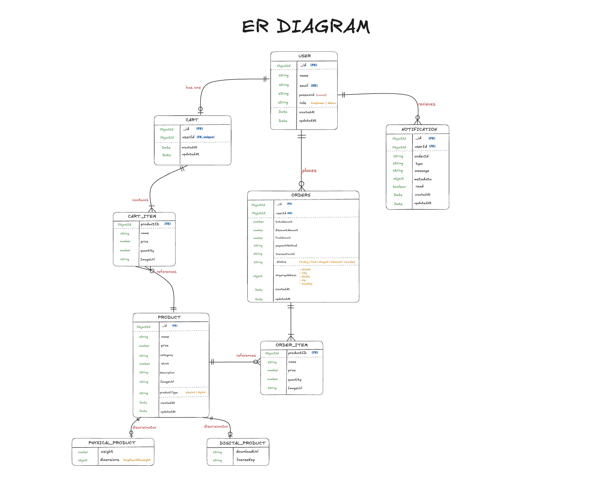

# 🛒 E-Commerce Platform

A production-grade, scalable **Mini E-Commerce Platform** built with the **MERN stack** (MongoDB, Express, React, Node.js) and **TypeScript**. Architecturally designed with strict OOP principles, featuring **4 design patterns** implemented across 8 modules.

---

## 🏗️ Architecture Overview

```
┌─────────── Frontend (React + Vite + TailwindCSS) ───────────┐
│  Context (Auth, Cart) → Pages → Components → API Service     │
│  Axios interceptors for JWT + 401 redirect                   │
└──────────────────────────┬───────────────────────────────────┘
                           │ REST API (/api/*)
┌──────────────────────────▼───────────────────────────────────┐
│                  Backend (Express + TypeScript)               │
│                                                               │
│  Routes → Controllers (thin) → Services (business logic)     │
│                                    │                          │
│              ┌─────────────────────┼──────────────────┐      │
│              ▼                     ▼                  ▼      │
│         Interfaces          Design Patterns        Models    │
│    (IPaymentStrategy,      (Strategy, Factory,   (Mongoose)  │
│     IDiscountStrategy,      Observer, State)                  │
│     INotificationObserver,                                    │
│     IOrderState)                                              │
└──────────────────────────────────────────────────────────────┘
                           │
                    MongoDB Database
```

---
## DIAGRAMS

Excalidraw URL: https://excalidraw.com/#room=931f37ddc819da5b8b7f,46B46RRH9nqD3BOEEAkcdQ (contains both ER and UML)

<h2 align="center">ER Diagram</h2>

<p align="center">
  
</p>


---
## 🎯 OOP Concepts & Design Patterns

### Design Patterns Implemented

| Pattern | Files | Purpose |
|---------|-------|---------|
| **Strategy** | `strategies/payments/*`, `strategies/discounts/*`, `services/PaymentService.ts`, `services/DiscountService.ts` | Payment methods (CreditCard, UPI, Wallet) and discount types (Percentage, Flat, Coupon) are interchangeable strategies |
| **Factory** | `factories/ProductFactory.ts` | Creates correct product subclass (Physical/Digital) with extensible registration |
| **Observer** | `observers/EmailNotifier.ts`, `observers/InAppNotifier.ts`, `services/NotificationService.ts` | Order events trigger all registered notification channels |
| **State** | `states/PendingState.ts`, `states/PaidState.ts`, `states/ShippedState.ts`, `states/DeliveredState.ts` | Order lifecycle transitions are validated via state classes |

### Four Pillars of OOP

| Pillar | Example |
|--------|---------|
| **Encapsulation** | `User.comparePassword()` — password hashing inside model, not controller. `Cart.addItem()` — no direct array manipulation. |
| **Abstraction** | `IPaymentStrategy`, `IDiscountStrategy`, `INotificationObserver` — services depend on interfaces, not concrete classes |
| **Polymorphism** | `PaymentService.process(strategy)` — works for any payment type. `ProductFactory.create(type)` — returns correct subclass |
| **Composition** | `Order HAS-A OrderItems[]`. `OrderService HAS-A NotificationService` (injected via constructor) |

### Dependency Injection Example

```typescript
// OrderService receives all collaborators via constructor
const orderService = new OrderService(
  notificationService,  // HAS-A, not IS-A
  paymentService,
  inventoryService,
  discountService,
  cartService
);
```

---

## 📁 Project Structure

```
backend/src/
├── interfaces/         ← TypeScript interfaces (contracts)
│   ├── IPaymentStrategy.ts
│   ├── INotificationObserver.ts
│   ├── IDiscountStrategy.ts
│   └── IOrderState.ts
├── strategies/         ← Concrete strategy implementations
│   ├── payments/       (CreditCardPayment, UPIPayment, WalletPayment)
│   └── discounts/      (PercentageDiscount, FlatDiscount, CouponDiscount)
├── factories/
│   └── ProductFactory.ts
├── observers/
│   ├── EmailNotifier.ts
│   └── InAppNotifier.ts
├── states/
│   ├── PendingState.ts, PaidState.ts, ShippedState.ts
│   ├── DeliveredState.ts, CancelledState.ts
├── models/             (User, Product, Cart, Order, Notification)
├── services/           (AuthService, ProductService, CartService,
│                        OrderService, PaymentService, NotificationService,
│                        DiscountService, InventoryService)
├── controllers/        (Thin HTTP handlers)
├── routes/
├── middleware/         (authMiddleware, errorHandler)
├── utils/              (AppError, idGenerator)
└── server.ts

frontend/src/
├── context/            (AuthContext, CartContext)
├── services/           (api.ts — Axios with interceptors)
├── components/         (Navbar, ProductCard, CartItem, OrderStatus, PaymentForm)
├── pages/              (Home, ProductList, ProductDetail, Cart, Checkout,
│                        Orders, Login, Register)
├── App.tsx
└── main.tsx
```

---

## 🔌 API Endpoints

| Method | Endpoint | Auth | Role | Description |
|--------|----------|------|------|-------------|
| POST | `/api/auth/register` | ✗ | — | Register new user |
| POST | `/api/auth/login` | ✗ | — | Login user |
| GET | `/api/auth/profile` | ✓ | — | Get current user profile |
| GET | `/api/products` | ✗ | — | List products (filters, pagination) |
| GET | `/api/products/categories` | ✗ | — | Get all categories |
| GET | `/api/products/:id` | ✗ | — | Get product details |
| POST | `/api/products` | ✓ | Admin | Create product |
| PUT | `/api/products/:id` | ✓ | Admin | Update product |
| DELETE | `/api/products/:id` | ✓ | Admin | Delete product |
| GET | `/api/cart` | ✓ | — | Get user's cart |
| POST | `/api/cart/items` | ✓ | — | Add item to cart |
| PATCH | `/api/cart/items/:id` | ✓ | — | Update item quantity |
| DELETE | `/api/cart/items/:id` | ✓ | — | Remove item from cart |
| DELETE | `/api/cart` | ✓ | — | Clear cart |
| POST | `/api/orders` | ✓ | Customer | Place order (checkout) |
| GET | `/api/orders/my-orders` | ✓ | Customer | Get my orders |
| GET | `/api/orders` | ✓ | Admin | Get all orders |
| PATCH | `/api/orders/:id/status` | ✓ | Admin | Transition order status |
| GET | `/api/orders/:id` | ✓ | — | Get order by ID |
| GET | `/api/discounts/coupons` | ✗ | — | Get available coupons |
| POST | `/api/discounts/apply` | ✓ | — | Apply discount to price |
| GET | `/api/notifications` | ✓ | — | Get my notifications |
| PATCH | `/api/notifications/:id/read` | ✓ | — | Mark notification read |
| PATCH | `/api/notifications/read-all` | ✓ | — | Mark all read |

---

## 🚀 Setup Instructions

### Prerequisites
- Node.js 18+
- MongoDB running locally (or MongoDB Atlas URI)

### 1. Clone & Configure

```bash
cd E_Commerce_SD_Prj

# Backend
cp backend/.env.example backend/.env
# Edit backend/.env with your MongoDB URI and JWT secret
```

### 2. Install Dependencies

```bash
# Backend
cd backend && npm install

# Frontend
cd ../frontend && npm install
```

### 3. Start Development

```bash
# Terminal 1 — Backend (port 5000)
cd backend && npm run dev

# Terminal 2 — Frontend (port 3000)
cd frontend && npm run dev
```

### 4. Access the App

Open **http://localhost:3000** in your browser.

### Available Coupon Codes
| Code | Discount |
|------|----------|
| `SAVE10` | 10% off (max $50) |
| `FLAT20` | 20% off (max $100, min order $200) |
| `WELCOME` | 15% off (max $30) |
| `MEGA50` | 50% off (max $500, min order $1000) |

---

## ⚠️ Edge Cases Handled

1. **Payment Failure** — Order stays pending, inventory NOT deducted, structured error returned
2. **Out-of-Stock** — Atomic `findOneAndUpdate` with `$gte` condition prevents overselling/race conditions
3. **Role Guard** — Admin-only routes protected via `requireRole('admin')` middleware
4. **JWT Expiry** — Axios interceptor catches 401, clears token, and redirects to login
