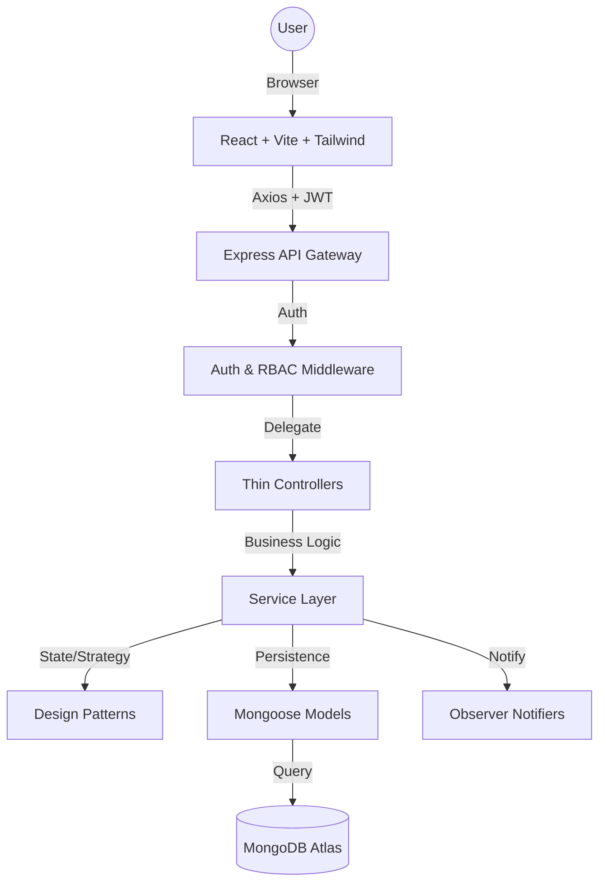

#  ShopSmart — Advanced Multi-Vendor eCommerce Platform

ShopSmart is a production-grade, highly scalable **Multi-Vendor Marketplace** built using the **MERN stack** (MongoDB, Express, React, Node.js) and **TypeScript**. This project serves as a masterclass in **System Design**, **Design Patterns**, and **Enterprise-Level Architecture**.

---
### Live Link: [Link](https://shopsmart-sd-prj-ecom.vercel.app)
### Project Report: [Project Report](https://drive.google.com/file/d/1dPGX9orj51_QdelIHJ-ku45jqBNgnBjk/view?usp=drive_link)
### Project Diagrams: [Project Diagrams](https://excalidraw.com/#room=931f37ddc819da5b8b7f,46B46RRH9nqD3BOEEAkcdQ)
##  Key Features

###  Multi-Vendor Architecture
*   **Sub-Order System:** When a customer buys items from multiple vendors, the system automatically splits the purchase into individual **Sub-Orders**. This allows each vendor to manage only their specific items without seeing data from competitors.
*   **Vendor Approval Workflow:** New vendors go through a "Pending" state and must be verified by an **Admin** before they can list products.

###  Advanced Design Patterns
*   **Strategy Pattern:** Interchangeable algorithms for **Payments** (Stripe, UPI, Wallet) and **Discounts** (Flat, Percentage, Coupon).
*   **State Pattern:** Robust Order Lifecycle management (Pending → Paid → Shipped → Delivered). Transitions are validated via dedicated state classes.
*   **Observer Pattern:** Decoupled notification system. The order service triggers events, and multiple observers (Email, In-App) react accordingly.
*   **Factory Pattern:** Centralized product creation for physical and digital goods.

###  Security & Hardening
*   **RBAC (Role-Based Access Control):** Granular permissions for `ADMIN`, `VENDOR`, and `CUSTOMER`.
*   **JWT Authentication:** Stateless security with secure token storage and automatic logout on expiry (Axios Interceptors).
*   **NoSQL Injection Protection:** Strict schema validation and input sanitization using `express-validator`.
*   **CORS Protection:** Hardened cross-origin settings for secure communication between Vercel and Render.

---

##  Architecture Overview



---

##  CI/CD & Deployment

This project is fully automated using **GitHub Actions**.

*   **Backend:** Hosted on **Render** (Node.js Environment).
*   **Frontend:** Hosted on **Vercel** (Vite Preset).
*   **Pipeline:** 
    1.  Developer pushes code to `master`.
    2.  GitHub Actions runs build checks for both Backend and Frontend.
    3.  On success, it triggers **Deploy Hooks** to Render and Vercel.

---

##  Project Structure

```text
backend/src/
├── interfaces/         ← Contracts for Patterns
├── strategies/         ← Payment & Discount Logic
├── factories/          ← Product Creation
├── observers/          ← Email & In-App Notifications
├── states/             ← Order Lifecycle Classes
├── models/             ← Mongoose Schemas
├── services/           ← Core Business Logic (The "Brain")
├── controllers/        ← Request Handlers
└── routes/             ← API Endpoint Definitions

frontend/src/
├── context/            ← Auth & Cart State
├── services/           ← api.ts (Interceptors)
├── pages/              ← Admin, Vendor, and Customer Dashboards
└── components/         ← Reusable UI Elements
```

---

##  Local Setup

### 1. Backend
```bash
cd backend
npm install
# Create .env based on .env.example
# Add MONGODB_URI, JWT_SECRET, and PORT=4000
npm run dev
```

### 2. Frontend
```bash
cd frontend
npm install
# Add VITE_API_URL=http://localhost:4000 in .env
npm run dev
```

---
##  Important Configurations
*   **CORS:** Backend `FRONTEND_ORIGIN` must match your Vercel URL.
*   **SPA Routing:** The `frontend/vercel.json` handles client-side routing to prevent 404s on page refresh.
*   **Database:** MongoDB Atlas must have IP Access set to `0.0.0.0/0` for Render to connect.
